## 1、环形图

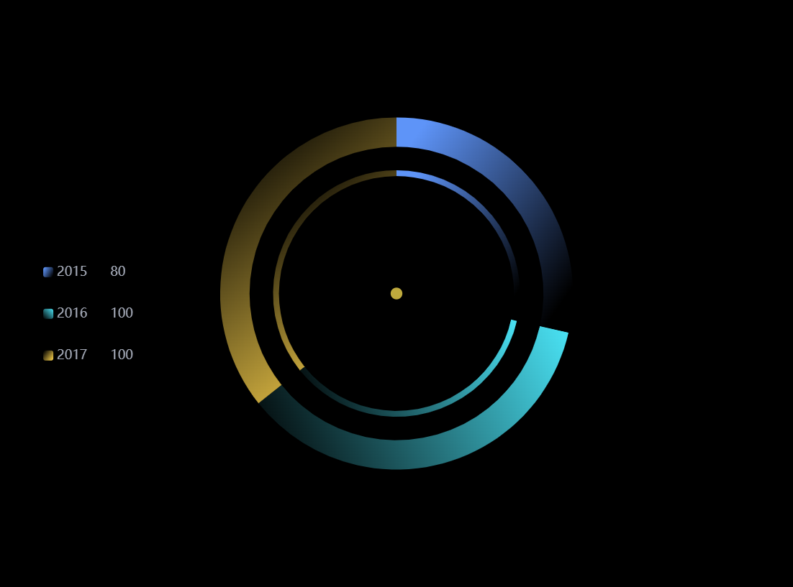

### 代码块

```javascript {}
const startAlpha = 1
const endAlpha = 0
const color = [
  {
    r: 94,
    g: 148,
    b: 248,
  },
  {
    r: 74,
    g: 227,
    b: 245,
  },
  {
    r: 246,
    g: 206,
    b: 75,
  },
]

const data = [
  {
    name: '2015',
    value: 80,
    _startArc: 0,
    _endArc: 1.0471975511965976,
    _color: '#1576d2',
    _percent: 0.16666666666666666,
  },
  {
    name: '2016',
    value: 100,
    _startArc: 1.0471975511965976,
    _endArc: 3.665191429188092,
    _color: '#d14a82',
    _percent: 0.4166666666666667,
  },
  {
    name: '2017',
    value: 100,
    _startArc: 3.665191429188092,
    _endArc: 3.9269908169872414,
    _color: '#26c1f2',
    _percent: 0.041666666666666664,
  },
]

/**
 * 线性渐变起止方向的计算方法
 *
 *
 * @param {*} startArc 开始角度
 * @param {*} endArc 结束角度
 * @returns 四个坐标 x,y,x2,y2
 */
function getCoordinates(startArc, endArc) {
  const posi = [
    Math.sin(startArc),
    -Math.cos(startArc),
    Math.sin(endArc),
    -Math.cos(endArc),
  ]
  const dx = posi[2] - posi[0]
  const dy = posi[3] - posi[1]

  return getLocation(dx, dy)
}

function getLocation(dx, dy) {
  const tanV = dx / dy
  const directSign = Math.abs(tanV) < 1
  const t = directSign ? tanV : 1 / tanV

  const sign1 = t > 0 ? 1 : -1
  const sign2 = dx > 0 ? 1 : -1
  const sign = directSign ? sign1 * sign2 : sign2

  const group1 = [0.5 - (sign * t) / 2, 0.5 + (sign * t) / 2]
  const group2 = sign > 0 ? [0, 1] : [1, 0]
  const group = [...group1, ...group2]
  const keys = directSign ? ['x', 'x2', 'y', 'y2'] : ['y', 'y2', 'x', 'x2']

  let res = {}
  keys.forEach((k, idx) => {
    res[k] = group[idx]
  })
  return res
}

/**
 * 给数据写入 样式(线性渐变)
 *
 * @param {*} datas 数据
 * @param {*} colorlist 颜色列表
 * @param {*} startAlpha 开始颜色的透明度
 * @param {*} endAlpha 结束颜色透的明度
 * @returns 带样式的数据
 */
function setGradientColorInItemSyle(datas, colorlist, startAlpha, endAlpha) {
  for (let i = 0; i < datas.length; i++) {
    const color = colorlist[i]
    const startArc = datas[i]._startArc
    const endArc = datas[i]._endArc
    // 这里计算了 线性渐变的起止方向
    const coordinates = getCoordinates(startArc, endArc)
    datas[i].itemStyle = {
      color: {
        ...coordinates,
        type: 'linear',
        global: false,
        // 这里给了 线性渐变的起止颜色
        colorStops: [
          {
            offset: 0,
            color: `rgba(${color.r}, ${color.g}, ${color.b}, ${startAlpha})`,
          },
          {
            offset: 1,
            color: `rgba(${color.r}, ${color.g}, ${color.b}, ${endAlpha})`,
          },
        ],
      },
    }
  }
  return datas
}

option = {
  backgroundColor: '#000',
  color: ['#BEA93D', '#4DECF2', '#67A2FF'],
  legend: {
    itemWidth: 14,
    itemHeight: 14,
    show: true,
    left: '5%',
    top: '40%',
    width: 100,
    itemGap: 40,
    formatter: name => {
      return (
        // {name|' + item.name + '}
        '{name|' +
        name +
        '} {percent|' +
        data.find(item => {
          return item.name == name
        }).value +
        '}'
      )
    },
    // itemStyle:{
    //   color: "red",
    // },
    textStyle: {
      fontSize: 14,
      rich: {
        name: {
          color: '#a6acba',
          fontSize: 18,
          width: 70,
        },
        percent: {
          color: '#a6acba',
          fontSize: 18,
        },
      },
    },
  },
  tooltip: {
    show: true,
    textStyle: {
      color: '#fff',
      fontSize: 15,
      fontFamily: '微软雅黑',
    },
  },
  series: [
    {
      type: 'pie',
      data: setGradientColorInItemSyle(data, color, startAlpha, endAlpha),
      animation: false,
      radius: ['50%', '60%'],
      center: ['50%', '50%'],
      labelLine: {
        show: false,
      },
      itemStyle: {
        linearGradient: true,
      },
      label: {
        normal: {
          show: false,
        },
      },
      hoverAnimation: false,
    },
    {
      type: 'pie',
      data: setGradientColorInItemSyle(data, color, startAlpha, endAlpha),
      animation: false,
      radius: ['40%', '42%'],
      center: ['50%', '50%'],
      labelLine: {
        show: false,
      },
      itemStyle: {
        linearGradient: true,
      },
      label: {
        normal: {
          show: false,
        },
      },
      hoverAnimation: false,
    },
    {
      type: 'pie',
      data: [100],
      animation: false,
      radius: ['0%', '2%'],
      center: ['50%', '50%'],
      labelLine: {
        show: false,
      },
      label: {
        normal: {
          show: false,
        },
      },
      itemStyle: {
        linearGradient: true,
      },
      hoverAnimation: false,
    },
  ],
}
```

## 2、立体柱状图

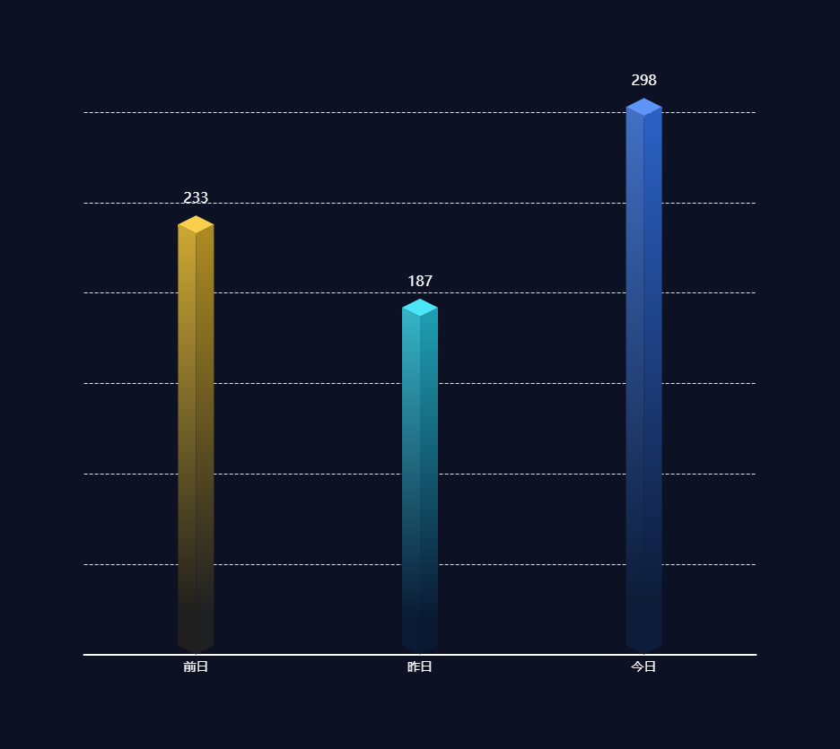

#### 代码块

```javascript
const offsetX = 20
const offsetY = 10
// 绘制左侧面
const CubeLeft = echarts.graphic.extendShape({
  shape: {
    x: 0,
    y: 0,
  },
  buildPath: function (ctx, shape) {
    // 会canvas的应该都能看得懂，shape是从custom传入的
    const xAxisPoint = shape.xAxisPoint
    // console.log(shape);
    const c0 = [shape.x, shape.y]
    const c1 = [shape.x - offsetX, shape.y - offsetY]
    const c2 = [xAxisPoint[0] - offsetX, xAxisPoint[1] - offsetY]
    const c3 = [xAxisPoint[0], xAxisPoint[1]]
    ctx
      .moveTo(c0[0], c0[1])
      .lineTo(c1[0], c1[1])
      .lineTo(c2[0], c2[1])
      .lineTo(c3[0], c3[1])
      .closePath()
  },
})
// 绘制右侧面
const CubeRight = echarts.graphic.extendShape({
  shape: {
    x: 0,
    y: 0,
  },
  buildPath: function (ctx, shape) {
    const xAxisPoint = shape.xAxisPoint
    const c1 = [shape.x, shape.y]
    const c2 = [xAxisPoint[0], xAxisPoint[1]]
    const c3 = [xAxisPoint[0] + offsetX, xAxisPoint[1] - offsetY]
    const c4 = [shape.x + offsetX, shape.y - offsetY]
    ctx
      .moveTo(c1[0], c1[1])
      .lineTo(c2[0], c2[1])
      .lineTo(c3[0], c3[1])
      .lineTo(c4[0], c4[1])
      .closePath()
  },
})
// 绘制顶面
const CubeTop = echarts.graphic.extendShape({
  shape: {
    x: 0,
    y: 0,
  },
  buildPath: function (ctx, shape) {
    const c1 = [shape.x, shape.y]
    const c2 = [shape.x + offsetX, shape.y - offsetY] //右点
    const c3 = [shape.x, shape.y - offsetX]
    const c4 = [shape.x - offsetX, shape.y - offsetY]
    ctx
      .moveTo(c1[0], c1[1])
      .lineTo(c2[0], c2[1])
      .lineTo(c3[0], c3[1])
      .lineTo(c4[0], c4[1])
      .closePath()
  },
})
// 注册三个面图形
echarts.graphic.registerShape('CubeLeft', CubeLeft)
echarts.graphic.registerShape('CubeRight', CubeRight)
echarts.graphic.registerShape('CubeTop', CubeTop)

const VALUE = [233, 187, 298]
const xAxisData = ['前日', '昨日', '今日']
const cubeTopColor = [
  ['#F8D04D', '#F8D04D'],
  ['#4BE6F8', '#4BE6F8'],
  ['#5E94F8', '#5E94F8'],
]
const cubeLeftColor = [
  ['#CDA932', '#201F1D'],
  ['#36B5C8', '#0A1A34'],
  ['#4270C5', '#0D1C39'],
]
const cubeRightColor = [
  ['#AE8C20', '#1F2021'],
  ['#1EA0B4', '#091932'],
  ['#2C62C6', '#0D1C39'],
]
option = {
  backgroundColor: '#0C1124',
  grid: {
    left: '10%',
    right: '10%',
    top: '15%',
    bottom: '10%',
    containLabel: true,
  },
  xAxis: {
    type: 'category',
    data: xAxisData,
    axisLine: {
      show: true,
      lineStyle: {
        width: 2,
        color: '#ffffff',
      },
    },
    axisTick: {
      show: false,
    },
    axisLabel: {
      fontSize: 14,
    },
  },
  yAxis: {
    type: 'value',
    axisLine: {
      show: false,
      lineStyle: {
        width: 2,
        color: '#2B7BD6',
      },
    },
    splitLine: {
      show: true,
      lineStyle: {
        type: 'dashed',
      },
    },
    axisLabel: {
      show: false,
    },
  },
  series: [
    {
      type: 'custom',
      renderItem: (params, api) => {
        const location = api.coord([api.value(0), api.value(1)])
        console.log(params.dataIndex, api, 'renderItem====================')
        return {
          type: 'group',
          children: [
            {
              type: 'CubeLeft',
              shape: {
                api,
                xValue: api.value(0),
                yValue: api.value(1),
                x: location[0],
                y: location[1],
                xAxisPoint: api.coord([api.value(0), 0]),
              },
              style: {
                fill: {
                  x: '0',
                  y: '0',
                  y2: '1',
                  global: false,
                  x2: '0',
                  colorStops: [
                    {
                      offset: 0,
                      color: cubeLeftColor[params.dataIndex][0],
                    },
                    {
                      offset: 0.9,
                      color: cubeLeftColor[params.dataIndex][1],
                    },
                  ],
                  type: 'linear',
                },
              },
            },
            {
              type: 'CubeRight',
              shape: {
                api,
                xValue: api.value(0),
                yValue: api.value(1),
                x: location[0],
                y: location[1],
                xAxisPoint: api.coord([api.value(0), 0]),
              },
              style: {
                fill: {
                  x: '0',
                  y: '0',
                  y2: '1',
                  global: false,
                  x2: '0',
                  colorStops: [
                    {
                      offset: 0,
                      color: cubeRightColor[params.dataIndex][0],
                    },
                    {
                      offset: 0.9,
                      color: cubeRightColor[params.dataIndex][1],
                    },
                  ],
                  type: 'linear',
                },
              },
            },
            {
              type: 'CubeTop',
              shape: {
                api,
                xValue: api.value(0),
                yValue: api.value(1),
                x: location[0],
                y: location[1],
                xAxisPoint: api.coord([api.value(0), 0]),
              },
              style: {
                fill: {
                  x: '0',
                  y: '0',
                  y2: '1',
                  global: false,
                  x2: '0',
                  colorStops: [
                    {
                      offset: 1,
                      color: cubeTopColor[params.dataIndex][0],
                    },
                    {
                      offset: 1,
                      color: cubeTopColor[params.dataIndex][1],
                    },
                  ],
                  type: 'linear',
                },
              },
            },
          ],
        }
      },
      data: VALUE,
    },
    {
      type: 'bar',
      label: {
        normal: {
          show: true,
          position: 'top',
          formatter: e => {
            return e.value
          },
          fontSize: 16,
          color: '#ffffff',
          offset: [0, -25],
        },
      },
      itemStyle: {
        color: 'transparent',
      },
      tooltip: {},
      data: VALUE,
    },
  ],
}
```

## 3、渐变柱状图

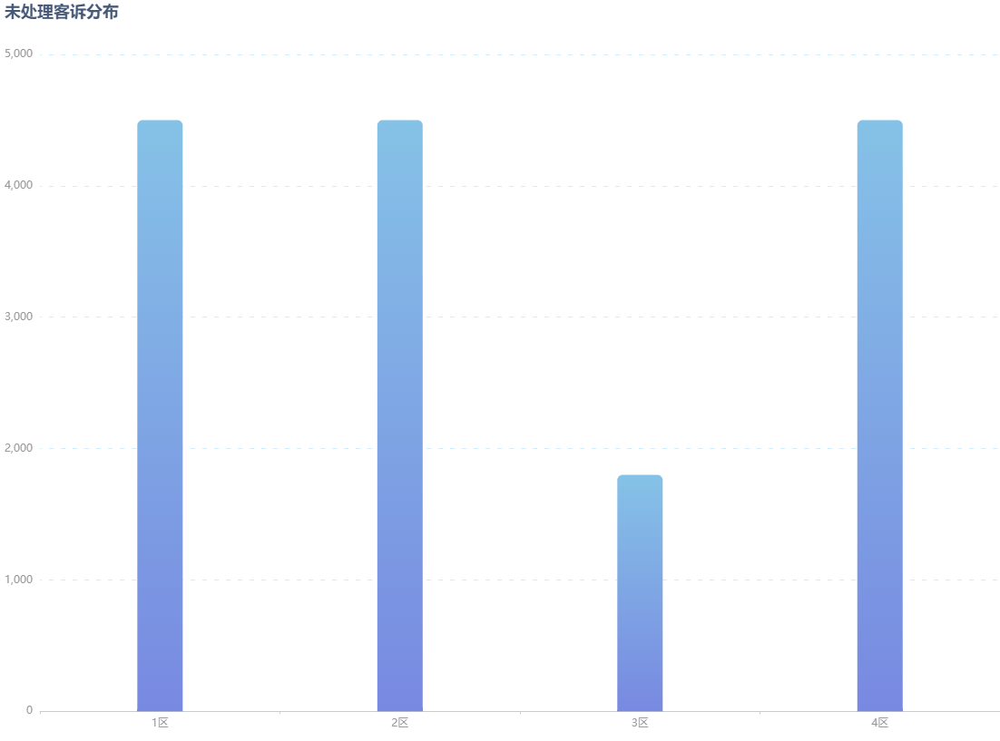

### 代码块

```javascript
option = {
  grid: {
    left: '4%',
    right: '0%',
    bottom: '4%',
  },
  title: {
    text: '未处理客诉分布',
    textStyle: {
      color: '#465877',
    },
  },
  xAxis: {
    type: 'category',
    data: ['1区', '2区', '3区', '4区'],
    axisLine: { lineStyle: { color: '#ccc' } },
    axisTick: { length: 3 },
    axisLabel: { color: '#999' },
  },
  yAxis: {
    type: 'value',
    axisLine: { show: false, lineStyle: { color: '#ccc' } },
    axisLabel: { color: '#999' },
    splitLine: {
      lineStyle: { color: ['#CEEDFF'], type: [5, 8], dashOffset: 3 },
    },
  },
  series: [
    {
      name: '当月出货数/码',
      type: 'bar',
      barWidth: 50,
      color: '#FFC53D',
      itemStyle: {
        borderRadius: [6, 6, 0, 0],
        color: {
          type: 'linear',
          x: 0,
          y: 1,
          x2: 0,
          y2: 0,
          colorStops: [
            {
              offset: 0,
              color: '#7889E1', //  0%  处的颜色
            },
            {
              offset: 1,
              color: '#85C2E7', //  100%  处的颜色
            },
          ],
          global: false, //  缺省为  false
        },
      },
      data: [4500, 4500, 1800, 4500],
    },
  ],
}
```

## 4、环形图

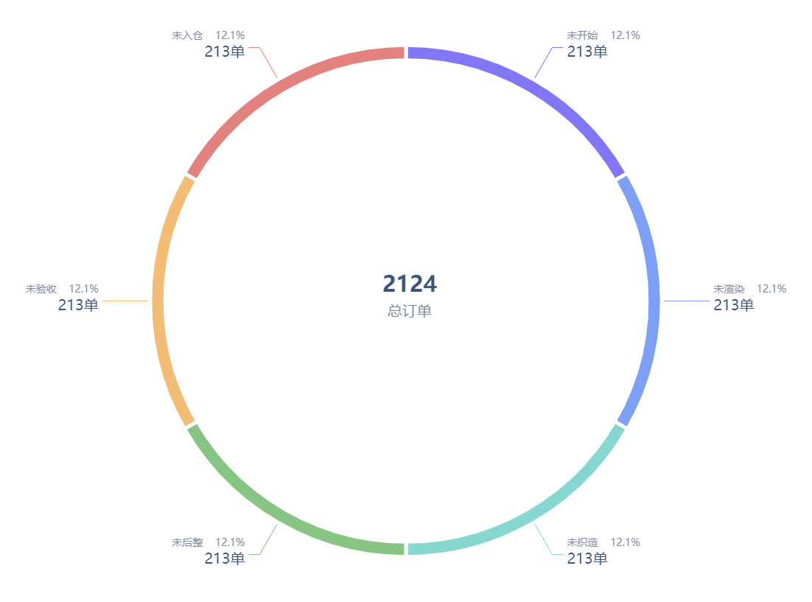

```javascript
let dataArr = [
  {
    value: 213,
    name: '未开始',
    percent: '12.1',
    color: '#4FACFE',
  },
  {
    value: 213,
    name: '未渲染',
    percent: '12.1',
    color: '#4FACFE',
  },
  {
    value: 213,
    name: '未织造',
    percent: '12.1',
    color: '#4FACFE',
  },
  {
    value: 213,
    name: '未后整',
    percent: '12.1',
    color: '#4FACFE',
  },
  {
    value: 213,
    name: '未验收',
    percent: '12.1',
    color: '#4FACFE',
  },
  {
    value: 213,
    name: '未入仓',
    percent: '12.1',
    color: '#4FACFE',
  },
]
const colorList = [
  '#8177F6',
  '#7D9FF8',
  '#87D7D1',
  '#88C484',
  '#F4BD77',
  '#E3817E',
]
option = {
  title: [
    {
      text: '2124',
      top: '45%',
      textAlign: 'center',
      left: '50%',
      textStyle: {
        color: '#3E5478',
        fontSize: 30,
      },
    },
    {
      text: '总订单',
      top: '50%',
      textAlign: 'center',
      left: '50%',
      textStyle: {
        fontWeight: '400',
        color: '#7E8CA2',
        fontSize: 20,
      },
    },
  ],
  backgroundColor: '#ffffff',
  color: colorList,
  grid: {
    left: 10,
    right: 10,
    top: 40,
    bottom: 20,
    containLabel: true,
  },
  series: [
    {
      name: '',
      type: 'pie',
      radius: ['80%', '85%'],
      center: ['50%', '50%'],
      zlevel: 10,
      itemStyle: {
        borderRadius: 0,
        normal: {
          borderWidth: 5,
          borderColor: '#ffffff',
        },
      },
      label: {
        normal: {
          formatter: param => {
            return (
              '{name|' +
              param.name +
              '\t\t\t\t' +
              param.data.percent +
              '%}' +
              '\n' +
              '{value|' +
              param.data.value +
              '单}'
            )
          },
          rich: {
            name: {
              fontSize: 14,
              color: '#7E8CA2',
            },
            value: {
              fontSize: 20,
              color: '#3E5478',
              height: 30,
            },
          },
        },
      },
      labelLine: {
        show: true,
        length: 50,
      },
      data: dataArr,
    },
  ],
}
```

## 5、带点线图

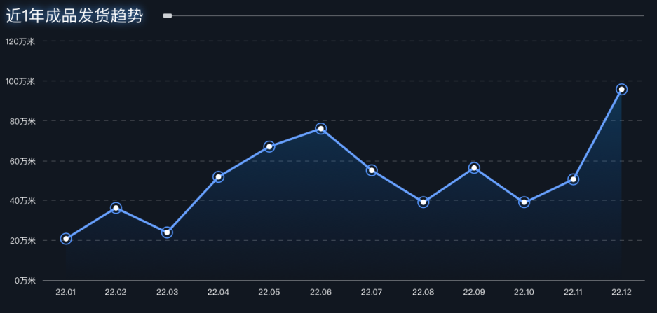

### 代码块

```javascript
option = {
  backgroundColor: '#000',
  legend: [
    {
      show: true,
      right: 0,
    },
  ],
  yAxis: [
    {
      gridIndex: '0',
      minInterval: 100,
      splitLine: {
        lineStyle: {
          width: 0.67,
          type: [5.33, 5.33],
          dashOffset: 2,
          opacity: 0.3,
        },
      },
    },
  ],
  xAxis: [
    {
      type: 'category',
      boundaryGap: false,
      axisTick: {
        show: false,
      },
    },
  ],
  grid: [
    {
      top: '25%',
      left: '8%',
      bottom: '20%',
      right: '4%',
    },
  ],
  series: [
    {
      areaStyle: {},
      emphasis: {
        focus: 'series',
      },
      symbol: 'circle',
      symbolSize: 15,
      showAllSymbol: true,
      lineStyle: {
        color: '#68A1FF',
        width: 2.67,
        type: 'solid',
      },
      itemStyle: {
        color: {
          type: 'radial',
          x: 0.5,
          y: 0.5,
          r: 0.5,
          colorStops: [
            {
              offset: 0,
              color: '#fff', //中心颜色
            },
            {
              offset: 0.4,
              color: '#fff',
            },
            {
              offset: 0.5,
              color: '#ffffff00',
            },
            {
              offset: 1,
              color: '#ffffff00',
            },
          ],
        },
        borderColor: '#5697FF',
        borderWidth: 1.33,
      },
      areaStyle: {
        color: {
          x: '0',
          y: '0',
          y2: '1',
          global: false,
          x2: '0',
          colorStops: [
            {
              offset: 0,
              color: 'rgba(14,156,225,23)',
            },
            {
              offset: 0.9,
              color: 'rgba(6,99,255,0)',
            },
          ],
          type: 'linear',
        },
      },

      type: 'line',
      seriesLayoutBy: 'row',
    },
  ],
  type: 'chart-line',
  seriesType: '0',
  dataset: {
    source: [
      ['product', 'Mon', 'Tue', 'Wed', 'Thu', 'Fri', 'Sat', 'Sun'],
      ['Email', 120, 132, 101, 134, 90, 230, 210],
    ],
  },
}
```

## 6、带底纹 堆叠柱状图

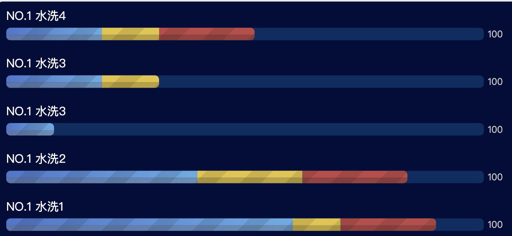

### 代码块

```javascript
let indexStart = []
const MAX = [100, 100, 100, 100, 100]
const VALUE = [60, 40, 10, 20, 20]
const VALUE2 = [10, 22, 0, 12, 12]
const VALUE3 = [20, 22, 0, 0, 20]
const NAMES = [
  'NO.1 水洗1',
  'NO.1 水洗2',
  'NO.1 水洗3',
  'NO.1 水洗3',
  'NO.1 水洗4',
]
option = {
  backgroundColor: '#010d3a',
  grid: {
    left: 0,
    top: 7,
    width: 611,
    height: 306,
    containLabel: false,
  },
  yAxis: {
    type: 'category',
    data: NAMES,
    axisLine: {
      show: false,
    },
    axisLabel: {
      show: false,
    },
  },
  xAxis: {
    type: 'value',
    show: false,
  },
  series: [
    {
      type: 'custom',
      stack: 'total',

      renderItem: (params, api) => {
        const location = api.coord([api.value(0), api.value(1)])
        const categoryIndex = api.value(0)
        const start = api.coord([0, categoryIndex])
        const end = api.coord([MAX[api.value(1)], categoryIndex])
        // const height = api.size([0, 1])[1] * 0.4;
        const width = api.size([api.value(0)])[0] // 对的
        //MAX[params.dataIndex]-

        console.log(
          'api',
          api.value(0),
          '#1:',
          api.value(1),
          '#2:',
          api.value(2),
          '#3:',
          params,
          '#end:',
          end
        )
        // alert(width)
        // indexStart[params.dataIndex] = width + start[0]
        const dv = (params, width, start) => {
          if (
            indexStart.length > 0 &&
            indexStart[params.dataIndex - MAX.length]
          ) {
            indexStart[params.dataIndex] = width + start[0]
            return (indexStart[params.dataIndex] = width + start[0])
          } else {
            indexStart[params.dataIndex] = width
            return 0
          }
        }
        return {
          type: 'group',

          children: [
            {
              type: 'rect',
              shape: {
                x: dv(params, width, start),
                y: location[1] - 14,
                width: width,
                height: 9,
                r: [5.3, VALUE2[params.dataIndex] != 0 ? 0 : 5.3, 0, 0],
              },
              style: {
                fill: new echarts.graphic.LinearGradient(1, 0, 0, 0, [
                  {
                    offset: 0,
                    color: '#6BC0FF',
                  },
                  {
                    offset: 1,
                    color: '#5183E3',
                  },
                ]),
                decal: {
                  dashArrayX: [1],
                  dashArrayY: [40, 1],
                  symbolSize: 2,
                  rotation: -Math.PI / 4,
                  color: 'rgba(0, 0, 0, 0.1)',
                },
              },
            },
            {
              type: 'rect',
              shape: {
                x: dv(params, width, start),
                y: location[1] - 5,
                width: width,
                height: 7,
                r: [0, 0, VALUE2[params.dataIndex] != 0 ? 0 : 5.3, 5.3],
              },
              style: {
                fill: new echarts.graphic.LinearGradient(1, 0, 0, 0, [
                  {
                    offset: 0,
                    color: '#6da0cd',
                  },
                  {
                    offset: 1,
                    color: '#6181be',
                  },
                ]),
                decal: {
                  dashArrayX: [1],
                  dashArrayY: [40, 1],
                  symbolSize: 2,
                  rotation: -Math.PI / 4,
                  color: 'rgba(0, 0, 0, 0.1)',
                },
              },
            },
          ],
        }
      },
      data: VALUE,
    },
    {
      type: 'custom',
      stack: 'total',
      itemStyle: {
        symbol: 'rect',
        symbolSize: 2,
        decal: {
          dashArrayX: [1],
          dashArrayY: [40, 1],
          symbolSize: 2,
          rotation: -Math.PI / 4,
          color: 'rgba(0, 0, 0, 0.3)',
        },
      },
      renderItem: (params, api) => {
        const location = api.coord([api.value(0), api.value(1)])
        const categoryIndex = api.value(0)
        const start = api.coord([api.value(1), categoryIndex])
        const end = api.coord([api.value(2), categoryIndex])
        // const height = api.size([0, 1])[1] * 0.4;

        const width = api.size([api.value(0)])[0] // 对的
        indexStart[params.dataIndex] = indexStart[params.dataIndex]
        return {
          type: 'group',

          children: [
            {
              type: 'rect',
              shape: {
                x: indexStart[params.dataIndex],
                y: location[1] - 14,
                width: width,
                height: 9,
                r: [0, VALUE3[params.dataIndex] != 0 ? 0 : 5.3, 0, 0],
              },
              style: {
                fill: new echarts.graphic.LinearGradient(1, 0, 0, 0, [
                  {
                    offset: 0,
                    color: '#FEDA44',
                  },
                  {
                    offset: 1,
                    color: '#FEDA44',
                  },
                ]),
                decal: {
                  dashArrayX: [1],
                  dashArrayY: [40, 1],
                  symbolSize: 2,
                  rotation: -Math.PI / 4,
                  color: 'rgba(0, 0, 0, 0.1)',
                },
              },
            },
            {
              type: 'rect',
              shape: {
                x: indexStart[params.dataIndex],
                y: location[1] - 5,
                height: 7,
                width: width,
                r: [0, 0, VALUE3[params.dataIndex] != 0 ? 0 : 5.3, 0],
              },
              style: {
                fill: new echarts.graphic.LinearGradient(1, 0, 0, 0, [
                  {
                    offset: 0,
                    color: '#d0b33b',
                  },
                  {
                    offset: 1,
                    color: '#d0b33b',
                  },
                ]),
                decal: {
                  dashArrayX: [1],
                  dashArrayY: [40, 1],
                  symbolSize: 2,
                  rotation: -Math.PI / 4,
                  color: 'rgba(0, 0, 0, 0.1)',
                },
              },
            },
          ],
        }
      },
      data: VALUE2,
    },
    {
      type: 'custom',
      stack: 'total',
      itemStyle: {
        symbol: 'rect',
        symbolSize: 2,
        decal: {
          dashArrayX: [1],
          dashArrayY: [40, 1],
          symbolSize: 2,
          rotation: -Math.PI / 4,
          color: 'rgba(0, 0, 0, 0.3)',
        },
      },
      renderItem: (params, api) => {
        const location = api.coord([api.value(0), api.value(1)])
        const categoryIndex = api.value(0)
        const start = api.coord([api.value(1), categoryIndex])
        const end = api.coord([api.value(2), categoryIndex])
        // const height = api.size([0, 1])[1] * 0.4;

        const width = api.size([api.value(0)])[0] // 对的
        indexStart[params.dataIndex] =
          indexStart[params.dataIndex] +
          api.coord([VALUE2[params.dataIndex]])[0]
        return {
          type: 'group',

          children: [
            {
              type: 'rect',
              shape: {
                x: indexStart[params.dataIndex],
                y: location[1] - 14,
                height: 9,
                width: location[0],
                r: [0, 5.3, 0, 0],
              },
              style: {
                fill: new echarts.graphic.LinearGradient(1, 0, 0, 0, [
                  {
                    offset: 0,
                    color: '#D75050',
                  },
                  {
                    offset: 1,
                    color: '#D75050',
                  },
                ]),
                decal: {
                  dashArrayX: [1],
                  dashArrayY: [40, 1],
                  symbolSize: 2,
                  rotation: -Math.PI / 4,
                  color: 'rgba(0, 0, 0, 0.1)',
                },
              },
            },
            {
              type: 'rect',
              shape: {
                x: indexStart[params.dataIndex],
                y: location[1] - 5,
                height: 7,
                width: location[0],
                r: [0, 0, 5.3, 0],
              },
              style: {
                fill: new echarts.graphic.LinearGradient(1, 0, 0, 0, [
                  {
                    offset: 0,
                    color: '#b14545',
                  },
                  {
                    offset: 1,
                    color: '#b14545',
                  },
                ]),
                decal: {
                  dashArrayX: [1],
                  dashArrayY: [40, 1],
                  symbolSize: 2,
                  rotation: -Math.PI / 4,
                  color: 'rgba(0, 0, 0, 0.1)',
                },
              },
            },
          ],
        }
      },
      data: VALUE3,
    },
    {
      type: 'bar',
      barWidth: 16,
      label: {
        normal: {
          show: true,
          position: 'right',
        },
      },
      itemStyle: {
        normal: {
          color: 'rgba(5,59,113,.7)',
          barBorderRadius: 5.3,
        },
      },
      z: -1,
      data: MAX,
    },
    {
      type: 'bar',
      barGap: '-100%',
      label: {
        formatter: function (param) {
          for (let i = 0; i < NAMES.length; i++) {
            if (param.dataIndex == i) {
              return NAMES[i]
            }
          }
        },
        show: true,
        offset: [0, -23],
        textStyle: {
          fontWeight: 400,
          fontSize: 15,
          color: '#fff',
        },
        position: 'topLeft',
      },
      barWidth: 28,
      itemStyle: {
        normal: {
          color: 'rgba(0,0,0,0)',
          barBorderRadius: 5.3,
        },
      },
      z: -2,
      data: MAX,
    },
  ],
}
```

## 7、圆环进度

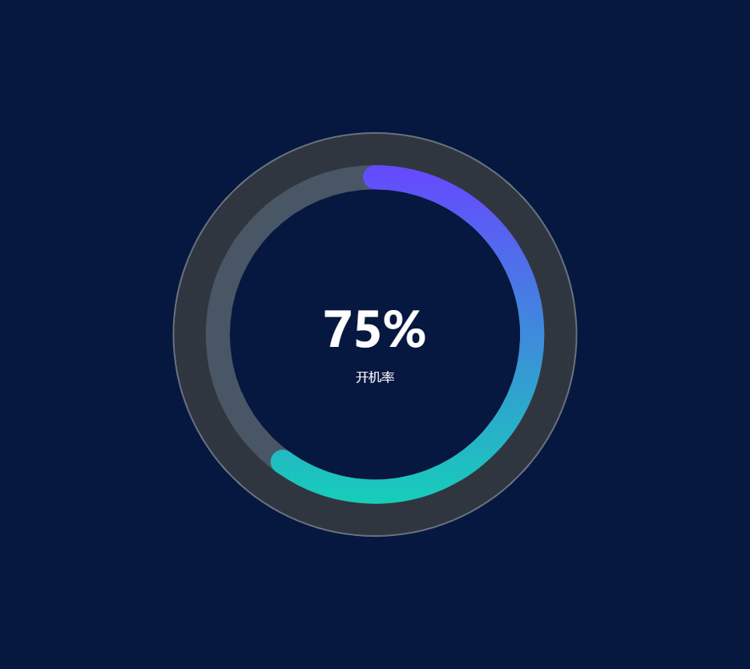

### 代码块

```javascript
let angle = 0 //角度，用来做简单的动画效果的
let value = 78 //图上角度数据
option = {
  backgroundColor: '#061740',
  title: [
    {
      text: '开机率',
      x: 'center',
      top: '55%',
      textStyle: {
        color: '#FFFFFF',
        fontSize: 16,
        fontWeight: '100',
      },
    },
    {
      text: '75%',
      x: 'center',
      y: 'center',
      textStyle: {
        fontSize: '60',
        color: '#FFFFFF',
        fontFamily: 'DINAlternate-Bold, DINAlternate',
        foontWeight: '600',
      },
    },
  ],
  polar: {
    radius: ['42%', '52%'],
    center: ['50%', '50%'],
  },
  angleAxis: {
    max: 100,
    show: false,
  },
  radiusAxis: {
    type: 'category',
    show: true,
    axisLabel: {
      show: false,
    },
    axisLine: {
      show: false,
    },
    axisTick: {
      show: false,
    },
  },
  series: [
    //外环
    {
      name: '',
      type: 'bar',
      roundCap: true,
      barWidth: 30,
      showBackground: true,
      backgroundStyle: {
        color: '#485665',
      },
      z: 1,
      data: [60],
      coordinateSystem: 'polar',
      itemStyle: {
        normal: {
          color: new echarts.graphic.LinearGradient(0, 1, 0, 0, [
            {
              offset: 0,
              color: '#16CEB9',
            },
            {
              offset: 1,
              color: '#6648FF',
            },
          ]),
        },
      },
    },
    {
      name: '',
      type: 'pie',
      radius: ['50%', '60%'],
      silent: true,
      clockwise: true,
      startAngle: 90,
      z: 0,
      zlevel: 0,
      label: {
        normal: {
          position: 'center',
        },
      },
      data: [
        {
          value: 100,
          name: '',
          itemStyle: {
            normal: {
              color: '#303640',
            },
          },
        },
      ],
    },
    {
      name: '',
      type: 'pie',
      radius: ['60%', '60.5%'],
      silent: true,
      clockwise: true,
      startAngle: 90,
      z: 2,
      zlevel: 0,
      label: {
        normal: {
          position: 'center',
        },
      },
      data: [
        {
          value: 100,
          name: '',
          itemStyle: {
            normal: {
              color: '#6A737C',
            },
          },
        },
      ],
    },
  ],
}
```

## 8、能量 柱状图

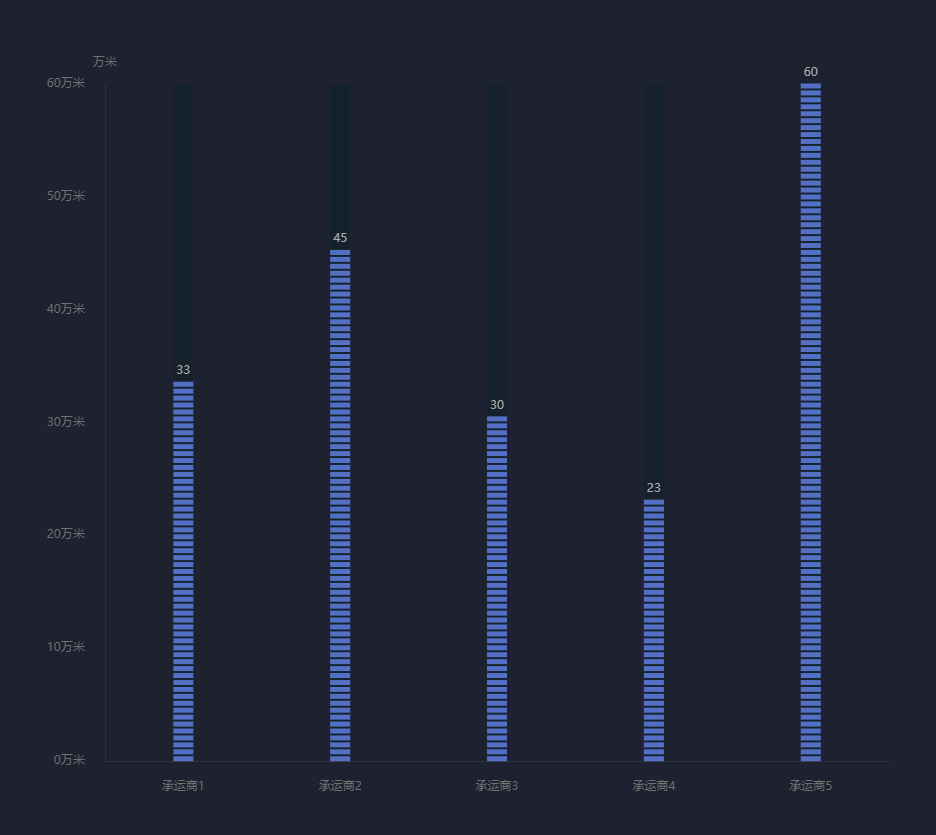

### 代码块

```javascript
option = {
  backgroundColor: 'rgba(30, 34, 48, 1)',
  grid: {
    left: '5%',
    top: '10%',
    right: '5%',
    bottom: '5%',
    containLabel: true,
  },
  xAxis: {
    type: 'category',
    data: ['承运商1', '承运商2', '承运商3', '承运商4', '承运商5'],
    axisLine: {
      lineStyle: {
        color: 'rgba(52, 51, 51, 1)',
      },
    },
    splitLine: { show: false },
    axisLabel: {
      margin: 20,
      textStyle: {
        fontFamily: 'MicrosoftYaHei',
        fontSize: 12,
        color: 'rgba(113, 113, 113, 1)',
      },
    },
    axisTick: { show: false },
  },
  yAxis: {
    type: 'value',
    name: '万米',
    nameTextStyle: {
      fontFamily: 'MicrosoftYaHei',
      fontSize: 12,
      color: 'rgba(113, 113, 113, 1)',
    },
    axisLine: {
      show: true,
      lineStyle: {
        color: 'rgba(52, 51, 51, 1)',
      },
    },
    splitLine: { show: false },
    axisLabel: {
      margin: 20,
      formatter: function (value) {
        return value + '万米'
      },
      textStyle: {
        fontFamily: 'MicrosoftYaHei',
        fontSize: 12,
        color: 'rgba(113, 113, 113, 1)',
      },
    },
    axisTick: { show: false },
  },
  series: [
    {
      name: '本日产量',
      type: 'pictorialBar',
      animationDuration: 0,
      legendHoverLink: false,
      symbolRepeat: 'true',
      symbolMargin: '20%',
      symbol: 'rect',
      symbolSize: [20, 5],
      itemStyle: {
        color: '#80BAF6',
        normal: {
          label: {
            show: true, //开启显示
            position: 'top', //在上方显示
            textStyle: {
              //数值样式
              color: '#aaa',
              fontSize: 12,
            },
          },
        },
      },
      data: [33, 45, 30, 23, 60],
      z: 1,
      animationEasing: 'elasticOut',
    },
    {
      //背景柱
      type: 'bar',
      barWidth: '20',
      barGap: '-90%',
      barCategoryGap: '-90%',
      showBackground: true,
      fontSize: '12px',
      backgroundStyle: {
        color: 'rgba(29, 44, 57, 0.69)',
      },
      itemStyle: {
        borderWidth: 1,
        borderColor: 'rgba(50, 65, 80, 0.6)',
      },
      z: 0,
      data: [0, 0, 0, 0, 0],
    },
  ],
}
```

## 9、中国地图

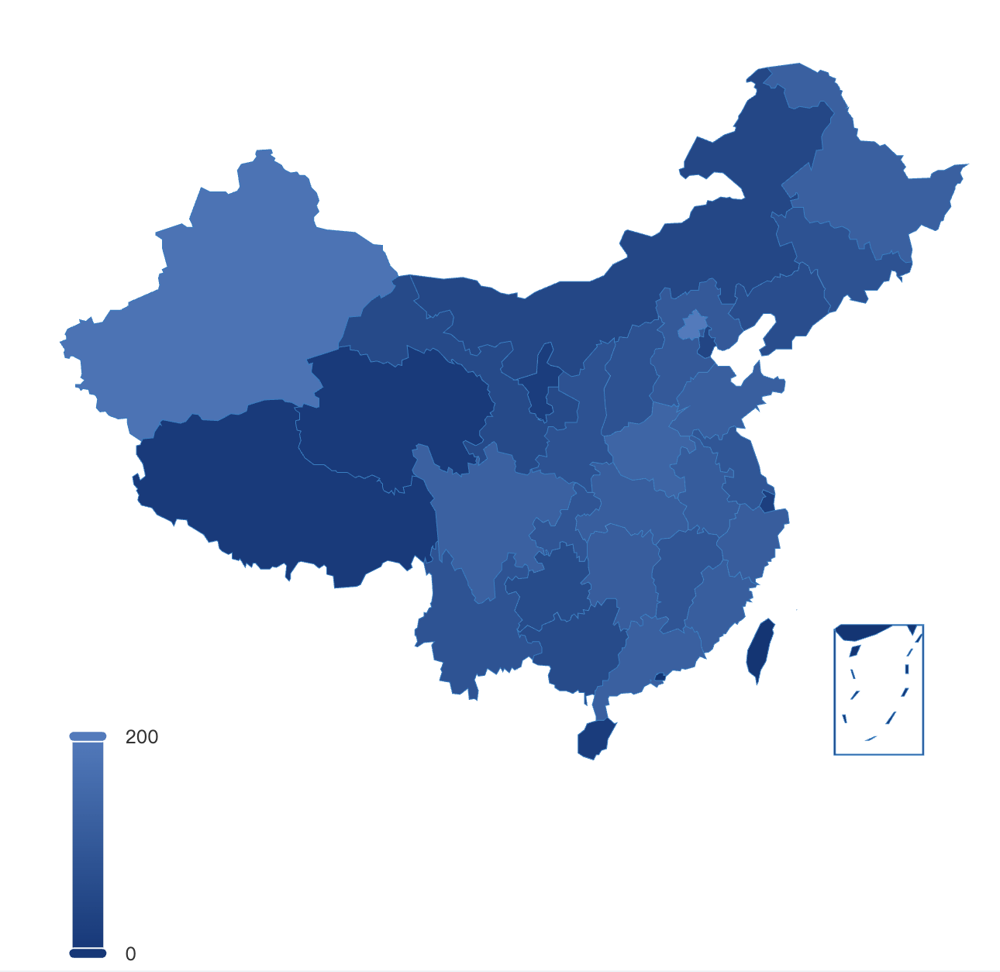

### 代码块

```javascript
var mapName = 'china'
var data = [
  { name: '北京', value: 199 },
  { name: '天津', value: 42 },
  { name: '河北', value: 102 },
  { name: '山西', value: 81 },
  { name: '内蒙古', value: 47 },
  { name: '辽宁', value: 67 },
  { name: '吉林', value: 82 },
  { name: '黑龙江', value: 123 },
  { name: '上海', value: 24 },
  { name: '江苏', value: 92 },
  { name: '浙江', value: 114 },
  { name: '安徽', value: 109 },
  { name: '福建', value: 116 },
  { name: '江西', value: 91 },
  { name: '山东', value: 119 },
  { name: '河南', value: 137 },
  { name: '湖北', value: 116 },
  { name: '湖南', value: 114 },
  { name: '重庆', value: 91 },
  { name: '四川', value: 125 },
  { name: '贵州', value: 62 },
  { name: '云南', value: 83 },
  { name: '西藏', value: 9 },
  { name: '陕西', value: 80 },
  { name: '甘肃', value: 56 },
  { name: '青海', value: 10 },
  { name: '宁夏', value: 18 },
  { name: '新疆', value: 180 },
  { name: '广东', value: 123 },
  { name: '广西', value: 59 },
  { name: '海南', value: 14 },
]

var geoCoordMap = {}

var uploadedDataURL = '/asset/get/s/data-1528971808162-BkOXf61WX.json'

$(function () {
  $.getJSON(uploadedDataURL, '', function (geoJson) {
    echarts.registerMap('china', geoJson)

    var max = 480,
      min = 9 // todo
    var maxSize4Pin = 100,
      minSize4Pin = 20

    option = {
      //左下角深度尺
      visualMap: {
        show: true,
        min: 0,
        max: 200,
        left: '10%',
        top: 'bottom',
        calculable: true,
        seriesIndex: [1],
        inRange: {
          color: ['#04387b', '#467bc0'], // 蓝绿
        },
      },
      geo: {
        show: true,
        map: mapName,
        roam: true,
        zoom: 1,
        label: {
          normal: {
            show: false,
          },
          emphasis: {
            show: false,
          },
        },
        itemStyle: {
          normal: {
            areaColor: '#023677',
            borderColor: '#1180c7',
          },
          emphasis: {
            areaColor: '#4499d0',
          },
        },
      },
      series: [
        {
          name: '散点',
          type: 'scatter',
          coordinateSystem: 'geo',
        },
        {
          type: 'map',
          map: mapName,
          geoIndex: 0,
          itemStyle: {
            normal: {
              areaColor: '#031525',
              borderColor: '#3B5077',
            },
            emphasis: {
              areaColor: '#2B91B7',
            },
          },
          animation: false,
          data: data,
        },
      ],
    }

    myChart.setOption(option)
  })
})
```

## 10、电池柱状图

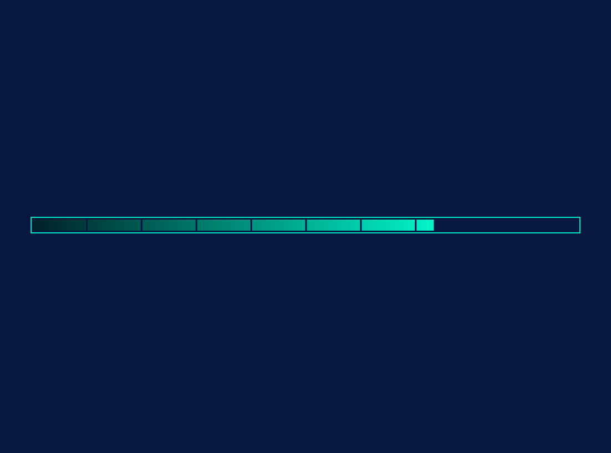

### 代码块

```javascript
let category = [{ name: '省外资金', value: '110' }] // 类别
let total = 150 // 数据总数
var datas = []
category.forEach(value => {
  datas.push(value.value)
})
option = {
  backgroundColor: '#061740',
  grid: {
    left: '5%',
    top: '10%', // 设置条形图的边距
    right: '5%',
    bottom: '10%',
  },
  xAxis: {
    max: total,
    show: false,
  },
  yAxis: [
    {
      type: 'category',
      inverse: false,
      data: category,
      show: false,
    },
  ],
  series: [
    {
      // 内
      type: 'bar',
      barWidth: 20,
      legendHoverLink: false,
      silent: true,
      itemStyle: {
        color: new echarts.graphic.LinearGradient(0, 0, 1, 0, [
          { offset: 0, color: '#002026' },
          { offset: 1, color: '#00f4c8' },
        ]),
      },
      data: category,
      z: 1,
    },
    {
      // 分隔
      type: 'pictorialBar',
      itemStyle: {
        normal: {
          color: '#061348',
        },
      },
      symbolRepeat: 'fixed',
      symbolMargin: 50,
      symbol: 'rect',
      symbolClip: true,
      symbolSize: [3, 23],
      symbolOffset: [1, -1],
      data: category,
      z: 2,
    },
    {
      // 外边框
      type: 'pictorialBar',
      symbol: 'rect',
      symbolBoundingData: total,
      itemStyle: {
        normal: {
          color: 'none',
        },
      },
      data: datas,
      z: 0,
    },
    {
      name: '外框',
      type: 'bar',
      barGap: '-125%', // 设置外框粗细
      data: [total],
      barWidth: 30,
      itemStyle: {
        normal: {
          color: 'transparent', // 填充色
          barBorderColor: '#00e6bd', // 边框色
          barBorderWidth: 2, // 边框宽度
          label: {
            // 标签显示位置
            show: false,
            position: 'top', // insideTop 或者横向的 insideLeft
          },
        },
      },
      z: 11,
    },
  ],
}
```

## 11、双线 动画 轮询

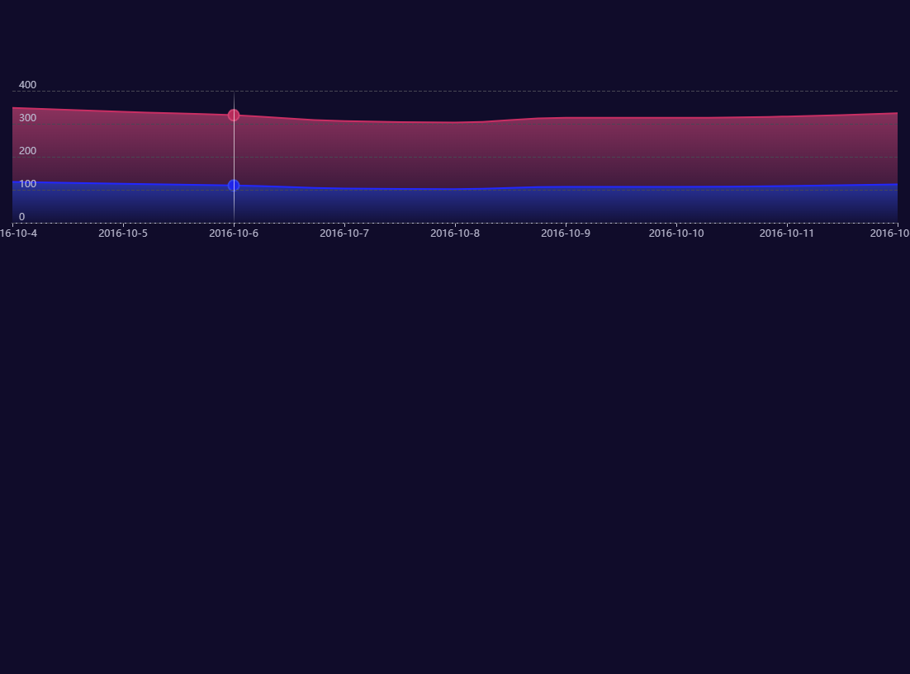

### 代码块

```javascript
option = {
  dataset: {
    source: [
      ['2016-10-4', 124, 224],
      ['2016-10-5', 118, 218],
      ['2016-10-6', 113, 213],
      ['2016-10-7', 104, 204],
      ['2016-10-8', 102, 202],
      ['2016-10-9', 109, 209],
      ['2016-10-10', 109, 209],
      ['2016-10-11', 111, 211],
      ['2016-10-12', 116, 216],
    ],
  },
  legend: {
    right: 0,
  },
  tooltip: {
    trigger: 'axis',
    triggerOn: 'none',
    backgroundColor: 'rgba(0,0,0,0.6)',
    borderColor: 'rgba(60,60,60,0.8)',
    // position:[e[0] + 20, 150],
    extraCssText: 'margin-top: -80px',
    textStyle: {
      color: '#fff',
    },
    axisPointer: {
      status: 'show',
      snap: true,
      lineStyle: {
        type: 'solid',
        opacity: 0.4,
        color: {
          x: 0,
          y: 0,
          y2: 1,
          global: false,
          x2: 0,
          colorStops: [
            {
              offset: 0,
              color: 'rgba(255,255,255,0)',
            },
            {
              offset: 0.2,
              color: 'rgba(255,255,255,1)',
            },
            {
              offset: 0.8,
              color: 'rgba(255,255,255,1)',
            },
            {
              offset: 1,
              color: 'rgba(255,255,255,0)',
            },
          ],
          type: 'linear',
        },
        width: 1,
      },
    },
  },
  xAxis: {
    type: 'category',
    triggerEvent: true,
    boundaryGap: false,
    splitLine: {
      show: false,
    },
  },
  yAxis: {
    minInterval: 100,
    splitLine: {
      lineStyle: {
        type: 'dashed',
      },
    },
    type: 'value',
    axisTick: {
      inside: true,
    },
    axisLabel: {
      inside: true,
      formatter: '{value}\n',
    },
    z: 10,
  },
  grid: {
    top: 110,
    left: 15,
    right: 15,
    height: 160,
  },
  dataZoom: [
    {
      type: 'inside',
      throttle: 50,
    },
  ],
  series: [
    {
      type: 'line',
      smooth: true,
      showSymbol: false,
      symbol: 'circle',
      symbolSize: 12,
      sampling: 'average',
      itemStyle: {
        color: '#0770FF',
        normal: {
          borderWidth: 2,
          borderColor: 'rgba(58,77,233,0.8)',
          color: 'rgba(31,36,233,1)',
        },
      },
      triggerLineEvent: true,
      // seriesLayoutBy: 'row',

      stack: 'a',
      areaStyle: {
        color: {
          x: 0,
          y: 0,
          y2: 1,
          global: false,
          x2: 0,
          colorStops: [
            {
              offset: 0,
              color: 'rgba(58,77,233,0.8)',
            },
            {
              offset: 1,
              color: 'rgba(58,77,233,0.1)',
            },
          ],
        },
      },
    },
    {
      type: 'line',
      smooth: true,
      stack: 'a',
      showSymbol: false,
      symbol: 'circle',
      symbolSize: 12,
      sampling: 'average',
      itemStyle: {
        color: '#F2597F',
        normal: {
          borderWidth: 2,
          borderColor: 'rgba(213,72,120,0.8)',
          color: 'rgba(183,42,90,1)',
        },
      },
      // seriesLayoutBy: 'row',
      areaStyle: {
        color: {
          x: 0,
          y: 0,
          y2: 1,
          global: false,
          x2: 0,
          colorStops: [
            {
              offset: 0,
              color: 'rgba(213,72,120,0.8)',
            },
            {
              offset: 1,
              color: 'rgba(213,72,120,0.3)',
            },
          ],
        },
      },
    },
  ],
}

let len = 0

setInterval(() => {
  let lens = myChart.getOption().dataset[0].source.length
  if (len === lens) {
    len = 0
  }
  myChart.dispatchAction({
    type: 'showTip',
    seriesIndex: 0,
    dataIndex: len,
  })
  len++
}, 1000)
```

## 12、伪 3D 饼图

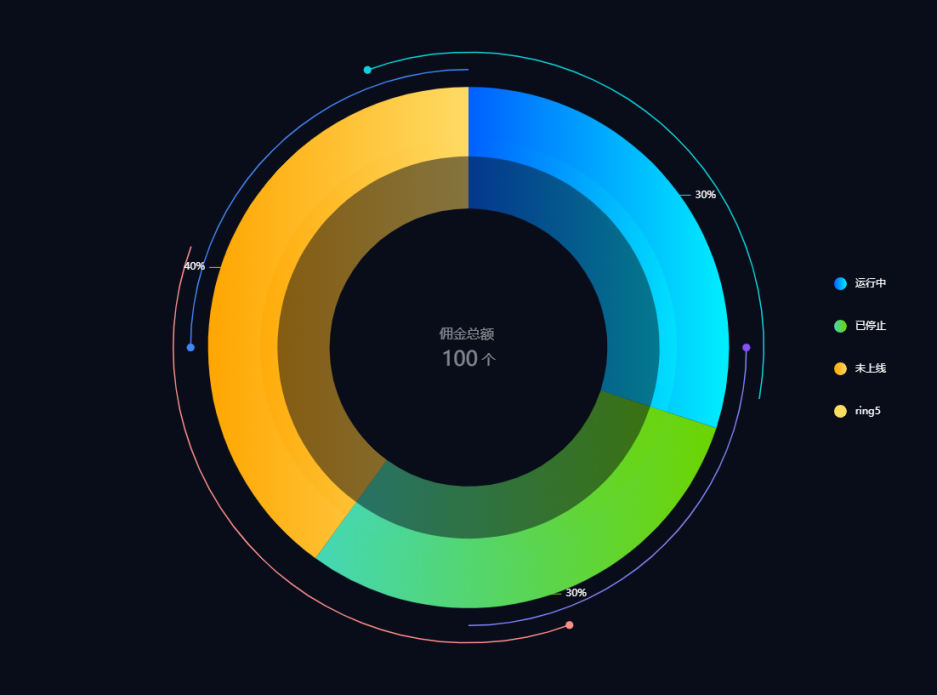

### 代码块

```javascript
let angle = 0 //角度，用来做简单的动画效果的
let value = 80
var timerId
var outerRidus1 = 0.8
var outerRidus2 = 0.85
option = {
  backgroundColor: '#090d1a',
  legend: {
    orient: 'vertical',
    show: true,
    right: '5%',
    y: 'center',
    icon: 'pin',
    itemGap: 30,
    textStyle: {
      color: '#FFFFFF',
      fontSize: 12,
      lineHeight: 20,
    },
  },
  tooltip: {
    show: true,
  },
  series: [
    // 最外层圆
    {
      type: 'pie',
      radius: ['75%', '55%'],
      center: ['50%', '50%'],
      hoverAnimation: false,
      data: [
        {
          value: 30,
          name: '运行中',
          itemStyle: {
            normal: {
              color: {
                // 完成的圆环的颜色
                colorStops: [
                  {
                    offset: 0,
                    color: '#0060FF', // 0% 处的颜色
                  },
                  {
                    offset: 1,
                    color: '#00EFFE', // 100% 处的颜色
                  },
                ],
              },
            },
          },
        },
        {
          value: 30,
          name: '已停止',
          itemStyle: {
            normal: {
              color: {
                // 完成的圆环的颜色
                colorStops: [
                  {
                    offset: 0,
                    color: '#44D7B6', // 0% 处的颜色
                  },
                  {
                    offset: 1,
                    color: '#6DD400', // 100% 处的颜色
                  },
                ],
              },
            },
          },
        },
        {
          value: 40,
          name: '未上线',
          itemStyle: {
            normal: {
              color: {
                // 完成的圆环的颜色
                colorStops: [
                  {
                    offset: 0,
                    color: '#FFA600', // 0% 处的颜色
                  },
                  {
                    offset: 1,
                    color: '#FEDB65', // 100% 处的颜色
                  },
                ],
              },
            },
          },
        },
      ],
      label: {
        show: true,
        position: 'outside',
        formatter: '{d}%',
        color: '#FFFFFF',
      },
      labelLine: {
        normal: {
          length: 80,
          lineStyle: {
            width: 1,
          },
        },
      },
    },
    // 内圆 + 中间文字
    {
      type: 'pie',
      radius: ['60%', '40%'],
      center: ['50%', '50%'],
      hoverAnimation: false,
      z: 10,
      label: {
        position: 'center',
        formatter: () => {
          return '佣金总额\r\n{total|100} 个'
        },
        rich: {
          total: {
            fontSize: 24,
            color: '#FFFFFF',
          },
        },
        color: '#FFFFFF',
        fontSize: 16,
        lineHeight: 30,
      },
      data: [
        {
          value: 30,
          name: '运行中',
          itemStyle: {
            normal: {
              color: {
                // 完成的圆环的颜色
                colorStops: [
                  {
                    offset: 0,
                    color: '#0060FF', // 0% 处的颜色
                  },
                  {
                    offset: 1,
                    color: '#00EFFE', // 100% 处的颜色
                  },
                ],
              },
              opacity: 0.5,
            },
          },
        },
        {
          value: 30,
          name: '已停止',
          itemStyle: {
            normal: {
              color: {
                // 完成的圆环的颜色
                colorStops: [
                  {
                    offset: 0,
                    color: '#44D7B6', // 0% 处的颜色
                  },
                  {
                    offset: 1,
                    color: '#6DD400', // 100% 处的颜色
                  },
                ],
              },
              opacity: 0.5,
            },
          },
        },
        {
          value: 40,
          name: '未上线',
          itemStyle: {
            normal: {
              color: {
                // 完成的圆环的颜色
                colorStops: [
                  {
                    offset: 0,
                    color: '#FFA600', // 0% 处的颜色
                  },
                  {
                    offset: 1,
                    color: '#FEDB65', // 100% 处的颜色
                  },
                ],
              },
              opacity: 0.5,
            },
          },
        },
      ],
      labelLine: {
        show: false,
      },
    },

    // 紫色线1 + 点
    {
      name: 'ring5',
      type: 'custom',
      coordinateSystem: 'none',
      renderItem: function (params, api) {
        return {
          type: 'arc',
          shape: {
            cx: api.getWidth() / 2,
            cy: api.getHeight() / 2,
            r: (Math.min(api.getWidth(), api.getHeight()) / 2) * outerRidus1, // 180,
            startAngle: ((0 + angle) * Math.PI) / 180,
            endAngle: ((90 + angle) * Math.PI) / 180,
          },
          style: {
            stroke: '#8383FA',
            fill: 'transparent',
            lineWidth: 1.5,
          },
          silent: true,
        }
      },
      data: [0],
    },
    // 紫色线1点
    {
      name: 'ring5', //紫点
      type: 'custom',
      coordinateSystem: 'none',
      renderItem: function (params, api) {
        let x0 = api.getWidth() / 2
        let y0 = api.getHeight() / 2
        let r = (Math.min(api.getWidth(), api.getHeight()) / 2) * outerRidus1
        let point = getCirlPoint(x0, y0, r, 0 + angle)
        return {
          type: 'circle',
          shape: {
            cx: point.x,
            cy: point.y,
            r: 4,
          },
          style: {
            stroke: '#8450F9', //绿
            fill: '#8450F9',
          },
          silent: true,
        }
      },
      data: [0],
    },
    // 蓝色
    {
      name: 'ring5',
      type: 'custom',
      coordinateSystem: 'none',
      renderItem: function (params, api) {
        return {
          type: 'arc',
          shape: {
            cx: api.getWidth() / 2,
            cy: api.getHeight() / 2,
            r: (Math.min(api.getWidth(), api.getHeight()) / 2) * outerRidus1, // 180,
            startAngle: ((180 + angle) * Math.PI) / 180,
            endAngle: ((270 + angle) * Math.PI) / 180,
          },
          style: {
            stroke: '#4386FA',
            fill: 'transparent',
            lineWidth: 1.5,
          },
          silent: true,
        }
      },
      data: [0],
    },
    {
      name: 'ring5', // 蓝色
      type: 'custom',
      coordinateSystem: 'none',
      renderItem: function (params, api) {
        let x0 = api.getWidth() / 2
        let y0 = api.getHeight() / 2
        let r = (Math.min(api.getWidth(), api.getHeight()) / 2) * outerRidus1 // 180
        let point = getCirlPoint(x0, y0, r, 180 + angle)
        return {
          type: 'circle',
          shape: {
            cx: point.x,
            cy: point.y,
            r: 4,
          },
          style: {
            stroke: '#4386FA', //绿
            fill: '#4386FA',
          },
          silent: true,
        }
      },
      data: [0],
    },
    // 橘色
    {
      name: 'ring5',
      type: 'custom',
      coordinateSystem: 'none',
      renderItem: function (params, api) {
        return {
          type: 'arc',
          shape: {
            cx: api.getWidth() / 2,
            cy: api.getHeight() / 2,
            r: (Math.min(api.getWidth(), api.getHeight()) / 2) * outerRidus2, // 200,
            startAngle: ((250 + -angle) * Math.PI) / 180,
            endAngle: ((10 + -angle) * Math.PI) / 180,
          },
          style: {
            stroke: '#0CD3DB',
            fill: 'transparent',
            lineWidth: 1.5,
          },
          silent: true,
        }
      },
      data: [0],
    },
    {
      name: 'ring5', //绿点
      type: 'custom',
      coordinateSystem: 'none',
      renderItem: function (params, api) {
        let x0 = api.getWidth() / 2
        let y0 = api.getHeight() / 2
        let r = (Math.min(api.getWidth(), api.getHeight()) / 2) * outerRidus2 // 200;
        let point = getCirlPoint(x0, y0, r, 250 + -angle)
        return {
          type: 'circle',
          shape: {
            cx: point.x,
            cy: point.y,
            r: 4,
          },
          style: {
            stroke: '#0CD3DB', //绿
            fill: '#0CD3DB',
          },
          silent: true,
        }
      },
      data: [0],
    },
    // 粉色
    {
      name: 'ring5',
      type: 'custom',
      coordinateSystem: 'none',
      renderItem: function (params, api) {
        return {
          type: 'arc',
          shape: {
            cx: api.getWidth() / 2,
            cy: api.getHeight() / 2,
            r: (Math.min(api.getWidth(), api.getHeight()) / 2) * outerRidus2, // 200,,
            startAngle: ((70 + -angle) * Math.PI) / 180,
            endAngle: ((200 + -angle) * Math.PI) / 180,
          },
          style: {
            stroke: '#FF8E89',
            fill: 'transparent',
            lineWidth: 1.5,
          },
          silent: true,
        }
      },
      data: [0],
    },
    //粉色点
    {
      name: 'ring5',
      type: 'custom',
      coordinateSystem: 'none',
      renderItem: function (params, api) {
        let x0 = api.getWidth() / 2
        let y0 = api.getHeight() / 2
        let r = (Math.min(api.getWidth(), api.getHeight()) / 2) * outerRidus2 // 200,;
        let point = getCirlPoint(x0, y0, r, 70 + -angle)
        return {
          type: 'circle',
          shape: {
            cx: point.x,
            cy: point.y,
            r: 4,
          },
          style: {
            stroke: '#FF8E89', //粉
            fill: '#FF8E89',
          },
          silent: true,
        }
      },
      data: [0],
    },
  ],
}

//获取圆上面某点的坐标(x0,y0表示坐标，r半径，angle角度)
function getCirlPoint(x0, y0, r, angle) {
  let x1 = x0 + r * Math.cos((angle * Math.PI) / 180)
  let y1 = y0 + r * Math.sin((angle * Math.PI) / 180)
  return {
    x: x1,
    y: y1,
  }
}

function draw() {
  angle = angle + 3
  _chart.setOption(option, true)
  //window.requestAnimationFrame(draw);
}
if (timerId) {
  clearInterval(timerId)
}
timerId = setInterval(function () {
  //用setInterval做动画感觉有问题
  draw()
}, 100)
```
